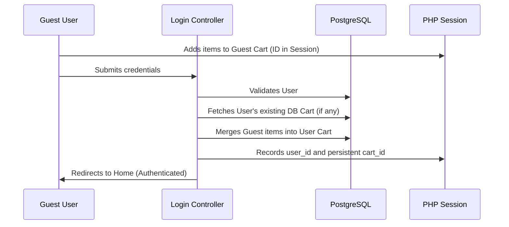

# EasyCart - Technical Developer Documentation

**EasyCart** is a high-performance, full-stack e-commerce platform built using native PHP 8.x and PostgreSQL. This documentation provides a comprehensive technical overview, describing every architectural layer, core workflow, and database element.

---

## 📚 Table of Contents
1.  [Project Architecture](#project-architecture)
2.  [Deep Application flows](#deep-application-flows)
3.  [Database Schema Reference](#database-schema-reference)
4.  [Admin & Management](#admin--management)
5.  [Setup & Configuration](#setup--configuration)

---

## <a id="project-architecture"></a>1. Project Architecture

EasyCart follows a custom-built **MVC (Model-View-Controller)** pattern, ensuring strict separation of concerns.

- **`src/Controllers/`**: Orchestrates page-level requests. It validates session state, prepares data from the database, and injects it into the views.
- **`src/Handlers/`**: A lightweight API and asynchronous logic layer. Handlers process **AJAX** requests (e.g., cart updates, CSV export) and return structured JSON or file streams.
- **`src/Views/`**: Pure presentation layer using PHP/HTML templates.
- **`src/Partials/`**: Reusable UI components (Header, Footer, Modals).
- **`src/Utils/`**: Backend services for business logic:
    - `shipping.utils.php`: Dynamic rate calculation based on DB rules.
    - `coupon.utils.php`: Validation and discount logic.
    - `cartsync.utils.php`: Merging guest and user carts.
    - `stripe.utils.php`: Secure payment orchestration.
- **`src/init.php`**: The central bootstrap file that handles session initialization, environment variables (`.env`), and database connection.

---

## <a id="deep-application-flows"></a>2. Deep Application Flows

### 🏠 System Initialization
Every request triggers `src/init.php`, which perform the following:
1. **Environment**: Loads `.env` variables via `phpdotenv`.
2. **Session**: Starts/resumes the PHP session.
3. **Connectivity**: Establishes a singleton PostgreSQL connection.
4. **Auth Detection**: Identifies the logged-in user and fetches their profile and `is_admin` status.
5. **Cart Context**: Checks for an existing `cart_id` or computes the total quantity for the header badge.

### 🔐 Authentication & Cart Synchronization
EasyCart ensures a seamless transition when a guest user logs in.



### 🛍️ The Shopping Journey (PLP & PDP)
- **Discovery (PLP)**: `plp.controller.php` fetches products with optimized sorting. In-stock products are prioritized at the top, while out-of-stock items are dimmed and sorted to the bottom.
- **Deep Attributes (PDP)**: Uses an EAV (Entity-Attribute-Value) pattern to fetch rich metadata like "Shipping Type", multiple high-res images, and detailed descriptions.

### 💳 Transactional Checkout Flow
1. **Address Memory**: Upon landing on `/checkout`, the system checks `customer_entity` for saved addresses. Users can toggle "Use Saved Address" for instant population.
2. **Dual Address Capture**: Supports separate Shipping and Billing addresses.
3. **Shipping Logic**: 
    - Detects "Freight" items (oversized) which forces specialized shipping methods.
    - Dynamically queries `sales_shipping_method` from the database.
4. **Payment Integrity**:
    - **Stripe**: The handler creates a `PaymentIntent`. Client-side Stripe Elements collect sensitive data to ensure PCI compliance.
    - **Final Verification**: Seconds before finalization, the system re-verifies stock counts to prevent overselling.

---

## <a id="database-schema-reference"></a>3. Database Schema Reference

### 👤 Customer Domain
**`customer_entity`**
| Column | Type | Description |
| :--- | :--- | :--- |
| `entity_id` | SERIAL (PK) | Unique User ID |
| `name` | VARCHAR(255) | Full Name |
| `email` | VARCHAR(255) | Unique Email |
| `mobile` | VARCHAR(20) | Contact Number |
| `password` | VARCHAR(255) | Hashed Password (bcrypt) |
| `street_address` | TEXT | Saved Street Address |
| `city` | VARCHAR(100) | Saved City |
| `pincode` | VARCHAR(20) | Saved Pincode |
| `is_admin` | BOOLEAN | Admin Privilege Flag |

### 📦 Catalog Domain
**`catalog_product_entity`**
| Column | Type | Description |
| :--- | :--- | :--- |
| `entity_id` | SERIAL (PK) | Unique Product ID |
| `sku` | VARCHAR(100) | Unique Stock Keeping Unit |
| `name` | VARCHAR(255) | Product Display Name |
| `price` | DECIMAL(12,2)| Unit Price |
| `stock_count` | INT | Physical Stock available |

**`catalog_product_attribute`**
| Column | Type | Description |
| :--- | :--- | :--- |
| `entity_id` | INT (FK) | Links to Product |
| `attribute_key` | VARCHAR | e.g. 'shipping_type', 'color' |
| `attribute_value`| TEXT | Technical Value |

### 🛒 Sales Domain (Cart & Orders)
**`sales_cart`**
| Column | Type | Description |
| :--- | :--- | :--- |
| `cart_id` | SERIAL (PK) | Unique Cart ID |
| `user_id` | INT (FK) | Owner (Null if guest) |
| `is_active` | BOOLEAN | `TRUE` = Open, `FALSE` = Ordered |

**`sales_order`**
| Column | Type | Description |
| :--- | :--- | :--- |
| `order_id` | SERIAL (PK) | Internal ID |
| `order_number` | VARCHAR | Customer Receipt No. |
| `final_amount` | DECIMAL | Total Paid |
| `status` | VARCHAR | 'pending', 'paid', 'shipped' |
| `transaction_id`| VARCHAR | Stripe Reference ID |

---

## <a id="admin--management"></a>4. Admin & Management

### 🛠️ Admin Panel (`/admin`)
- **Dashboard**: Real-time visualization of Total Products, Orders, and Users.
- **Bulk Import**: `admin.handler.php` handles CSV parsing. It validates data and skips duplicate SKUs to maintain catalog integrity.
- **Background AJAX Export**: 
    1. Admin clicks "Download CSV".
    2. JavaScript triggers an AJAX call to the handler.
    3. The browser shows a loading state.
    4. The server generates the CSV stream.
    5. JavaScript processes the stream as a `Blob` and triggers a browser download programmatically.

---

## <a id="setup--configuration"></a>5. Setup & Configuration

1. **Install Dependencies**: `composer install`
2. **Environment**: Create a `.env` file with `STRIPE_SECRET_KEY` and `STRIPE_PUBLISHABLE_KEY`.
3. **Database**: 
   - Update `src/config/database.php`.
   - Import `src/models/schema.sql`.
4. **Admin Setup**: Manually set your account as an admin:
   ```sql
   UPDATE customer_entity SET is_admin = TRUE WHERE email = 'your@email.com';
   ```

---
*Developed for the Cybercom Internship Program.*
